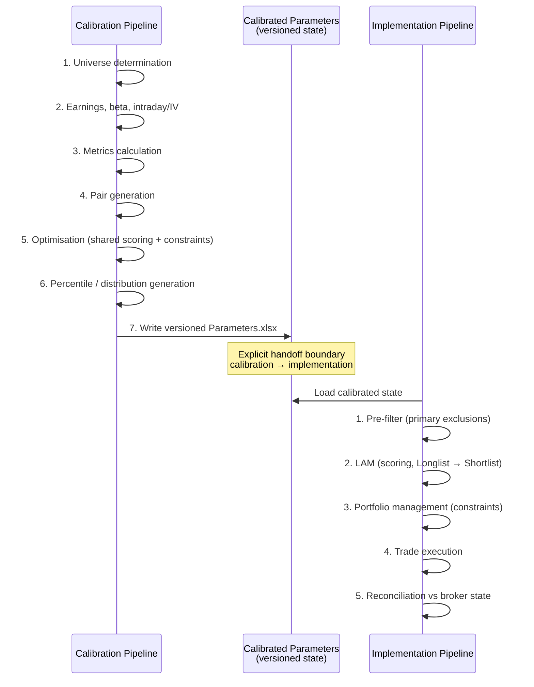

# Architecture

View [README](README.md) before this document.

This document describes the architecture of the reconstructed pairs trading system, the flow of data through its calibration and live implementation workflows, and the invariants that keep those workflows aligned. The emphasis is on responsibility boundaries: what each stage owns, what it consumes, what it produces, and where state is deliberately handed from one part of the system to another.

## Pipeline Overview

The system splits into two distinct, interdependent workflows. Calibration runs on a relatively slow cycle and establishes the universe, relationships, historical distributions, and parameters that define the strategy's operating state. Implementation runs during market hours and applies that calibrated state to current market data.

The core architectural boundary is not simply calibration versus execution. Calibration produces a versioned state object that implementation consumes directly. The live workflow does not independently reconstruct assumptions previously determined during calibration.

At a high level, data flows as follows:

### Calibration

1. Universe determination
2. Earnings calendar, beta/alpha estimation, intraday data and IV generation
3. Metrics
4. Pair selection
5. Optimisation
6. Percentile/distribution generation
7. Calibrated parameters

### Implementation

1. Current market data
2. Pre-filter
3. LAM/scoring
4. Portfolio management and constraints
5. Trade execution
6. Stops/monitoring
7. Reconciliation

The two workflows meet at the calibrated outputs rather than through direct module-to-module dependencies. This makes calibration state an explicit artefact rather than an implicit collection of values scattered across implementation code.

## Calibration Pipeline

Calibration determines what the live system assumes about the tradable universe and security relationships. It is deliberately separated from the daily implementation workflow, as these historical calculations are computationally heavy and update at a slower frequency.

### Universe determination

Establishes the tradable equity universe from the relevant sector ETFs, applies structural exclusions, and determines the sector/sub-sector relationships used downstream.

### Earnings

Builds the relevant event calendar so that earnings-related moves can be distinguished from ordinary pair divergence.

### Beta and alpha estimation

Estimates stock relationships against the relevant sub-sector reference rather than relying solely on a broad market benchmark. The resulting beta, alpha, and return series become inputs to later calibration stages.

### Intraday data and IV generation

Provides the historical intraday and implied-volatility information required by the downstream metrics and candidate evaluation process.

### Metrics

Calculates the historical characteristics used to evaluate candidate pairs and their trading behaviour.

### Pair generation

Produces the candidate pair universe. In the public reconstruction the proprietary selection logic is represented through an interface (`pair_generator_interface.py`) and a reference implementation that produces structurally valid output.

### Optimisation

Evaluates historical candidates using the same canonical scoring and constraint definitions that the live workflow uses. The reference optimiser explicitly imports `scoring_constants` and `constraints` from the shared layer, demonstrating this parity boundary. This is a critical calibration/live alignment mechanism.

### Percentiles and parameter extraction

Converts the historical results into the distributions, thresholds, and parameters required by implementation. These outputs form the explicit handoff from calibration into live trading.

The output of calibration is therefore not simply a set of selected pairs. It is a calibrated representation of the state under which the implementation workflow operates. Versioning that state allows the live workflow and subsequent investigation to identify which calibration produced a particular trading decision.

## Live Pipeline

The live workflow applies the calibrated state to the current market. Its responsibility is to move from a broad current candidate set to a constrained set of portfolio decisions, and then to translate those decisions into broker state.

### Pre-filter

Loads the calibrated state and current market data, applies the primary filters and exclusions, and produces the filtered candidate set that LAM consumes. Derived quantities that belong to this stage are calculated here rather than independently reconstructed downstream.

### LAM / scoring

Receives the filtered candidates from pre-filter and acts as the principal candidate-evaluation stage between the broad filtered universe and portfolio-level decision making. It applies the calibrated state, current market observations, primary and secondary candidate-level signals, and the canonical scoring rules.

Its principal stages are:

1. Primary signal evaluation establishes the initial signal state for each candidate.
2. The Longlist contains candidates that have passed the primary evaluation and remain eligible for further consideration.
3. Secondary scoring applies the additional candidate-level evaluation and ranking logic.
4. The Shortlist contains candidates that survive secondary evaluation and are ranked for portfolio consideration.
5. The resulting candidate-level state is passed to portfolio management rather than directly to execution.

LAM determines candidate attractiveness; portfolio management determines whether an attractive candidate is permissible. This keeps candidate-level signal evaluation separate from portfolio-level constraints and existing position context.

LAM also consumes the same canonical scoring definitions used during calibration. This is the mechanism that prevents the optimisation process from evaluating one definition of a good trade while live implementation applies another.

Where the underlying scoring or signal-generation logic is proprietary, the public reconstruction preserves the interface and data contract rather than exposing the implementation. The surrounding pipeline can therefore be exercised and verified against the same architectural boundary without releasing the alpha-generating component.

### Portfolio management

Evaluates the ranked candidates alongside the existing portfolio. Existing positions are considered before new entries, termination rules are applied, and portfolio-level constraints determine which otherwise attractive candidates can actually be admitted.

### Execution

Translates approved portfolio decisions into broker orders. Decision logic and broker interaction remain separate responsibilities: the execution layer acts on an approved decision rather than independently deciding whether a signal is attractive.

### Reconciliation

Compares the system's expected state with external broker state and identifies discrepancies before they can silently propagate into subsequent decisions.

This separation matters because the live workflow contains several different kinds of decision. LAM determines candidate attractiveness; portfolio management determines whether an attractive candidate is permissible; execution determines how that decision is represented at the broker; reconciliation determines whether the system's internal model still matches external reality.

## Module Interactions

The module structure is organised around dependency direction rather than around the historical order in which scripts happened to be created. Shared infrastructure sits below the calibration, implementation, and execution layers. Higher-level modules consume shared calculations, configuration, and contracts rather than maintaining private copies of those definitions.

The principal interaction pattern is:

- Calibration imports shared configuration, calculations, and constraints, and produces calibrated state.
- Implementation imports the same shared definitions and consumes calibrated state.
- Execution consumes portfolio decisions and shared execution infrastructure rather than calculating strategy signals itself.
- Proprietary or signal-specific dependencies are represented by explicit interfaces, allowing the surrounding system to be exercised without exposing the underlying implementation.
- Reconciliation sits at the boundary between internal portfolio intent and external broker state.

A key consequence is that modules do not need to know how an upstream result was generated in order to consume it. They depend on the contract and its semantics. This makes individual components easier to test and replace, while also making accidental coupling more visible.

## Data Contracts

The major workflows communicate through explicit state rather than through implicit assumptions about what another module has already calculated. The principal contracts are the calibrated pair state, the parameter set, candidate/portfolio state, and execution state.

### Pair cache

Represents the calibrated pair universe and the historical information required to evaluate those pairs. In the public reconstruction, the proprietary generation process is replaced by a reference pair generator and a deterministic fixture, both conforming to the same output schema.

### Parameters

Consolidates the calibrated thresholds, distributions, and other values required by the live implementation. This is the principal calibration-to-live handoff.

### Longlist / Shortlist

Represents progressively enriched candidate state. Both are produced by LAM: the Longlist contains all candidates with primary signal state; the Shortlist contains candidates that have survived secondary scoring and ranking.

### Portfolio state

Represents the positions and trade state that portfolio management and execution need in order to make decisions and track their consequences.

### Execution / broker state

Represents the state required to compare intended actions with actual external positions and executions during reconciliation.

## The Single-Source-of-Truth Invariant

The central invariant of the reconstruction is that definitions which affect calibration and implementation exist in one authoritative location. Duplicating a threshold, calculation, or constraint creates the possibility that the research system and the live system silently diverge.

- Configuration values are externalised rather than embedded independently in modules.
- Shared quantitative calculations have a single implementation.
- Scoring constants and canonical scoring rules are shared between optimisation and live candidate evaluation.
- Portfolio constraints are defined centrally rather than reconstructed downstream.
- Derived quantities are calculated at the stage that owns them and passed downstream as state where appropriate.

This is more than a maintainability preference. Calibration only provides useful evidence about live execution if both are evaluating the same thing. The architecture therefore treats duplication of behavioural definitions as a potential model-validity problem, not merely a code-quality problem.

## Configuration Architecture

Configuration is separated from implementation logic so that calibrated and operational state can change without requiring changes to the code that implements the workflow. The sanitised configuration file provides the public schema for these values while keeping credentials and machine-specific details out of source control.

The configuration layer covers strategy parameters, thresholds, operational constraints, paths, and version-specific output locations. Modules retrieve these values through shared configuration rather than maintaining local copies. This prevents one module from silently operating with a different parameter value from another.

Version-specific directories and calibrated outputs make the state of the system at a particular calibration point identifiable. This is important both for reproducibility and for investigating historical trading decisions: the implementation can be associated with the calibrated state that produced it.

## Error Handling and Degradation

Failure behaviour is treated as an explicit architectural decision rather than an exception-handling detail. The system distinguishes between critical data failures that halt execution and optional subsystem dependencies that degrade safely.

### Data timeliness verification

Incoming price payloads are evaluated against a configurable staleness threshold (`price_staleness_threshold` in `src/shared/config.py`). The shared calculations layer (`src/shared/calculations.py`) validates data freshness before allowing prices to enter signal calculations. Inputs exceeding the threshold fail validation immediately rather than propagating stale quotes into downstream signals.

### Delisting and corporate action handling

Delisting handling operates at two levels. In the implementation layer, `src/implementation/pre_filter.py` loads delisted tickers from a maintained exclusion list and drops affected symbols from candidate generation during primary filtering. In the execution layer, `src/execution/delisting_handler.py` manages the portfolio impact when an existing position's ticker is delisted or acquired — closing counterpart legs, liquidating acquirer shares, and recording the exit reason.

### Isolated subsystem fallbacks

Proprietary calculation modules — the pair generator, optimiser, signal scorer, and factor-shock detector — are each accessed through explicit interfaces. If a proprietary dependency is unavailable, the pipeline falls back to a reference implementation rather than aborting the active pass. The public reconstruction provides reference implementations for all four.

### Reconciliation and execution guards

Order submissions and partial fills do not automatically update local portfolio state. The execution layer forces reconciliation against real broker state before making downstream decisions, ensuring unresolved discrepancies fail closed.

The general rule throughout the system is that degradation is deliberate: optional functionality relies on explicit fallbacks, whereas critical state or data failures fail closed. The system never continues execution simply because an exception was suppressed.

## Verification Strategy and Tests

Numerical stability and architectural decoupling are verified through a dedicated test suite in `tests/`:

### Calculation regression testing

To guarantee that refactoring did not alter underlying mathematical behaviour — such as the intentionally arithmetic cumulative return calculations — core calculation functions are tested against known inputs and expected outputs. These tests enforce exact numerical parity for alpha calculations, sum deviation bucketing, percentage change, and daily return computations.

### Deterministic fixture harness

Test suites execute without network or broker dependencies — `ib_insync` is an optional dependency and all top-level broker imports are guarded. Offline fixtures in `fixtures/` provide structurally valid synthetic market data. The fixture generator synthesises deterministic multi-asset snapshots to validate data contracts and pipeline transitions.

### State parity checks

Integration tests verify that `src/calibration/` and `src/implementation/` generate identical scoring metrics when evaluated on identical data frames, preventing subtle scoring drift between research and execution code.
