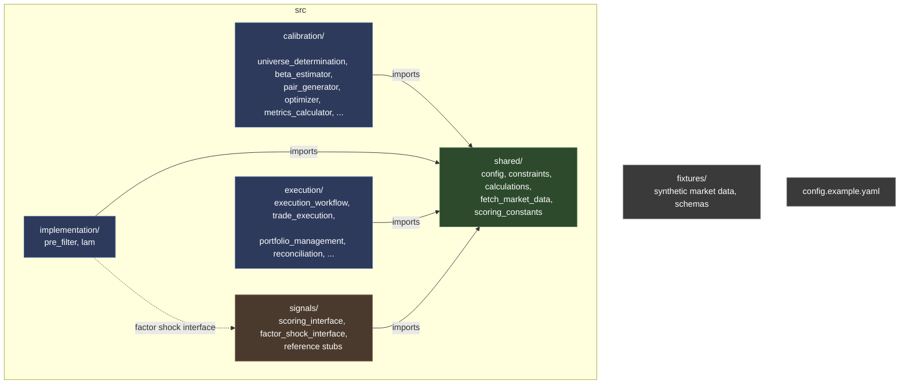

# Pairs Trading System — Architecture Reconstruction

[](https://github.com/sammaitland/pair-trading-system/actions/workflows/tests.yml)

This is a systematic equity pairs trading system, trading US equities drawn from five Vanguard sector ETFs (VGT, VFH, VIS, VHT, VCR) via Interactive Brokers. The core idea: within a given sector, two stocks that normally move together will occasionally diverge. The system detects these divergences, enters a long/short pair trade, and profits when the relationship reverts.

Comprises two distinct, but interdependent, workflows:

1. **Calibration** runs roughly every six months. Determines which pairs to watch and how to measure divergence.
2. **Implementation** runs daily during market hours. Filters today's pair universe, scores candidates, evaluates in conjunction with existing portfolio and constraints, then executes trades.

## Why I built it this way

Nine decisions: calibration/live parity · look-ahead bias · stability gates · transaction costs · behavioural preservation · stale-data handling · human-gated edge cases · reconciliation · failure isolation.

### Model risk and validation

**Calibration and Live Parity**

Calibration and live execution share one definition of a good trade. Early on, these were separate codepaths, and they drifted: calibration was optimising against slightly different scoring rules and constraints than live execution actually applied.

That class of bug is nearly invisible. Nothing errors, the backtest looks fine, and you end up slowly optimising for a strategy you aren't actually running.

I traced the divergence between the calibration and implementation paths, extracted the duplicated scoring logic, and moved those definitions into shared infrastructure. Now, both calibration and live execution consume the exact same canonical scoring rules, constants, and constraint definitions. If I change what counts as a good trade, it is structurally impossible to update it in one environment and forget it in the other.

**Finding and Removing Look-Ahead Bias**

I once got back a backtest result that looked implausibly clean. The result was too clean, so I searched for the leak.

Tracing the exclusion filters backwards through the calibration process, I found the culprit: a bubble-detection filter was evaluating asset state using data that wouldn't actually be known until later in the timeline. The backtest was flattering because it was effectively cheating.

I rebuilt the filter logic to strictly enforce a walk-forward model, guaranteeing that decisions made at time *t* could only access information that existed at time *t*. The resulting performance figures degraded, but they became real. A backtest is useless if it doesn't faithfully reproduce the exact information set available to the live strategy — I will take credible evidence over attractive performance metrics every time.

**Selecting for Stability Over Peak Backtest Performance**

Unconstrained optimisation inevitably latches onto whatever configuration looks best historically, creating massive overfitting risk in an empirically calibrated strategy. A candidate can easily "win" an optimisation pass while remaining deeply fragile in practice.

To mitigate this, I implemented a system of multiple independent admission gates rather than allowing a single aggregate metric like peak Sharpe ratio to drive selection. Candidates are forced to survive distinct filters evaluating retention, parameter stability, and repeatability across varying regimes.

This deliberately filters out some historically impressive candidates. The goal isn't to ask "what maxes out the historical curve?", but rather "what continues to hold up when challenged from multiple angles?" I willingly trade off theoretical peak backtest performance for confidence that the surviving logic isn't dependent on a narrow historical artefact.

**Making Transaction Costs Reflect Actual Execution**

Fixed basis-point assumptions rarely survive contact with reality. Treating an illiquid, wide-spread symbol as if it carries the same execution friction as a mega-cap ETF distorts signal evaluation — often making unviable trades look deceptively attractive.

I replaced static cost assumptions with dynamic, spread-based friction models and embedded them directly into the selection and calibration phase, rather than bolting them on as a post-hoc accounting adjustment. The critical takeaway wasn't just that overall reported returns decreased; it was that different signals survived. Incorporating realistic market friction fundamentally changed which trades were deemed worth taking in the first place.

### Refactoring discipline

**Preserving Non-Textbook Behaviour During Refactoring**

During the refactor, I encountered cumulative return calculations using arithmetic summing rather than standard geometric compounding. Textbook finance dictates geometric treatment, and the immediate temptation during a system cleanup is to "fix" what looks like an obvious oversight.

Before changing it, I traced how the metric propagated downstream. I realised that the historical calibration thresholds, risk limits, and signal distributions were all explicitly tuned around the arithmetic definition. Standardising to geometric returns would have silently broken the system's calibrated mechanics. I preserved the arithmetic implementation, choosing behavioural continuity over theoretical elegance.

**Building and Refactoring with AI Assistance**

I used AI extensively during the reconstruction, but treated it as an implementation and reasoning aid rather than as an authority on the system.

The difficult part wasn't generating individual functions; it was maintaining an accurate model of the existing system while making changes across a large number of interdependent modules. I used AI to navigate and summarise unfamiliar parts of the existing codebase, identify duplicated logic and potential dependency problems, propose refactoring approaches, generate and rework repetitive implementation, trace data and control flow across modules, and help construct tests and verification checks.

Generated changes were treated as proposals, not as evidence that the implementation was correct. I had to determine whether the suggested interpretation of the existing behaviour was actually correct, whether a proposed "improvement" would change production behaviour, whether dependencies had been moved in the correct direction, whether a refactor preserved numerical outputs, and whether failure behaviour remained correct.

This was particularly important because the system contained deliberately non-obvious behaviour: arithmetic rather than geometric returns, calibration/live differences, historical workarounds, edge-case handling, and dependencies whose importance wasn't obvious from the individual function implementing them.

AI was therefore most useful as a way of increasing the amount of code and system reasoning I could inspect, rather than replacing the need to understand the system myself.

I validated the resulting architecture through tests, numerical comparisons, import and dependency checks, synthetic fixtures, tracing behaviour back to the original implementation, and checking that changes preserved the intended invariants.

The important distinction is that AI generated or suggested implementation, but I owned the architectural decisions and the validation of those decisions. This allowed me to work effectively across a codebase substantially larger and more complex than I could comfortably hold in my head at once, while still treating correctness and behavioural preservation as my responsibility.

### Operational robustness

**Handling Stale Data**

Missing data is loud and easy to catch because it throws an exception. Stale data is far more dangerous because it passes structural validation while quietly poisoning your pipeline — a system can successfully retrieve a price payload that is structurally complete, yet entirely too old to support an execution decision.

I elevated freshness to an explicit, first-class data-quality dimension alongside schema type and format. The pipeline validates payload timestamps against strict operational windows before allowing data to enter the signal generator. A hard pipeline halt on stale inputs is infinitely safer than generating a plausible but wildly incorrect trading signal.

**Automating Detection Without Automating Ambiguous Decisions**

When an asset undergoes a corporate event or delisting notice, the automated response is not to guess what to do. Attempting to fully automate messy edge cases leads to complex, brittle code paths that fail catastrophically when an unprecedented corporate action occurs.

I drew a hard boundary between automated exclusion and manual intervention. The implementation layer drops delisted tickers from candidate generation during primary filtering, preventing new exposure. The execution layer handles the portfolio impact separately — closing counterpart legs of affected pairs, liquidating acquirer shares, and recording the exit reason. This two-level approach keeps the candidate pipeline deterministic without introducing dangerous, unmaintainable edge-case logic into the execution engine.

**Reconciliation and External State**

Assuming internal order state perfectly mirrors broker state creates drift, especially when orders drop, partially fill, or execute out of band during volatile market conditions.

I designed the execution layer around continuous, active reconciliation. Every execution cycle queries external broker state directly, verifies open positions, and reconciles execution state against local intent before submitting new orders. If local records and broker reality diverge, the system halts order submission and forces state reconciliation first.

**Failure Isolation and Partial Degradation**

A failure in an optional pipeline component does not take down the core system. In early iterations, a failure in a secondary data model or non-critical shock calculation could crash the entire execution pass.

I restructured execution boundaries to ensure failure isolation. By wrapping optional components — like factor-shock calculations — in explicit interfaces with safe fallback stubs, the main trading engine continues executing against primary constraints even if non-essential modules fail. The pipeline degrades gracefully rather than suffering complete operational failure.

## Structure



```
src/
  shared/           Shared infrastructure, data contracts, and quantitative calculations
  calibration/      Historical analysis to determine parameters and thresholds for live trading
  implementation/   Applies calibrated parameters to current market data to construct candidates
  execution/        Translates portfolio decisions into broker state transitions and reconciliation
  signals/          Interface contracts and reference stubs for excluded proprietary signal logic
fixtures/           Synthetic market datasets and payload schemas for running without live feeds
tests/              Unit and integration tests exercising pipeline invariants (83 tests)
docs/               Appendix material (beta stability analysis)
config.example.yaml Externalised configuration blueprint — no hardcoded logic or credentials
pyproject.toml      Project metadata and dependency specification
ARCHITECTURE.md     Deep-dive architectural documentation
CHANGE_MANUAL.md    Detailed record of changes made during reconstruction
ROADMAP.md          Excluded modules and features with rationale and status
```

## Getting Started

1. **Clone the repository**

```bash
git clone https://github.com/sammaitland/pair-trading-system.git
cd pair-trading-system
```

2. **Create a virtual environment and install dependencies**

```bash
python -m venv .venv
source .venv/bin/activate
pip install -e ".[dev]"
```

3. **Initialise environment configuration**

```bash
cp config.example.yaml config.yaml
```

4. **Populate local configuration**

Review `config.yaml` to adjust local file paths or synthetic generation parameters. No API keys, credentials, or live broker connections are required.

5. **Generate synthetic fixtures**

Run the included fixture generator to construct a deterministic, multi-asset synthetic market data snapshot:

```bash
python fixtures/synthetic_pairs.py --output fixtures/Synthetic_Parameters.xlsx
```

6. **Run the test suite**

```bash
pytest tests/
```

## What's included, what's excluded, and why

This is a sanitised reconstruction of the architecture of a production trading system. The repository preserves the engineering structure, interfaces, shared calculations, configuration, constraints, and operational workflows, while removing the components that contain proprietary strategy logic or aren't necessary to demonstrate the architecture.

**Included**

- Shared quantitative calculations and infrastructure
- Externalised configuration and parameter handling
- Calibration pipeline and its interfaces
- Implementation and execution pipeline
- Portfolio constraints, execution, and reconciliation
- Market-data interfaces and synthetic fixtures
- Reference implementations for deliberately excluded components
- Architectural documentation and data contracts

**Excluded**

- **Proprietary implementations behind four interface boundaries** — the production pair-generation logic, optimiser objective function, signal-scoring engine, and factor-shock model are each replaced by a reference stub. The interfaces, data contracts, and shared-definition consumption are preserved; the strategy-specific logic behind them is not.
- **Ad-hoc notebook entry points and unfinished scheduling utilities** — these were operational conveniences rather than core architectural components and are not necessary to demonstrate the system design.

The exclusions are therefore deliberate scope boundaries rather than attempts to simplify the system. Where an excluded component is important to the surrounding architecture, its interface and expected contract are retained so that the dependency can be understood without exposing the underlying implementation.

**What this repository is not**

- Not a release of the trading strategy or its alpha — the proprietary signal-generation components are not included.
- Not a backtest — the synthetic fixtures exist to exercise the architecture and its invariants, not to make claims about strategy performance.
- Not a production deployment — broker connectivity and other live dependencies are abstracted or replaced with reference components.
- Not a generic trading framework — the architecture reflects the specific requirements and evolution of this particular quantitative system.

## Limitations

While this codebase faithfully mirrors the software architecture and operational invariants of the underlying system, several domain-specific and operational limitations apply to this sanitised release:

**Synthetic Data vs. Live Dynamics**

The included data fixtures are deterministic and designed solely to exercise code paths and numerical invariants. They do not simulate realistic market microstructure, order book dynamics, slippage, or live liquidity constraints.

**Disconnected Execution Layer**

The reference environment does not connect to or exercise a live Interactive Brokers (IBKR) API. Broker connectivity (`ib_insync`) is an optional dependency (`pip install -e ".[broker]"`). Order routing and reconciliation logic are present but not exercised against real brokerage endpoints.

**Absent Proprietary Modules**

As noted, the production implementations of four proprietary components — pair generation, optimisation, signal scoring, and factor-shock detection — are replaced by reference stubs behind explicit interfaces.

**No Automated Scheduler**

The system is configured to run on-demand.

**Asset-Class and Microstructure Assumptions**

The current implementation embeds assumptions tailored specifically to spot liquid mid-cap US equities/ETFs operating within standard exchange trading hours. Adapting this architecture to non-equity asset classes would require re-evaluating:

- *Data Model and Microstructure*: Tick sizes, continuous vs. discrete trading sessions, and order book mechanics.
- *Execution and Liquidity*: Broker API abstractions, spread dynamics, fill probabilities, and cross-venue routing.
- *Risk and Calibration*: Volatility estimation windows, leverage/margin constraints, and overnight holding risk models.
